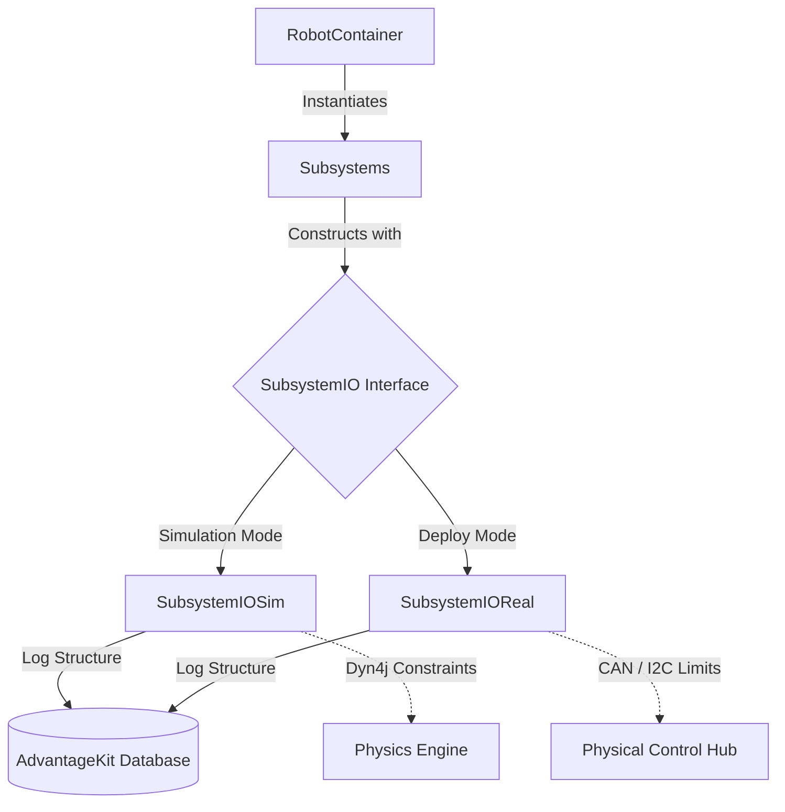

# ARESLib2 Quickstart Template
[](https://github.com/thehomelessguy/ARESLib2/actions)
Welcome to the ARESLib2 Quickstart! This template provides a full Command-Based FTC robot framework equipped with a physics simulator (Dyn4j) and AdvantageKit telemetry data-logging out of the box.

## How to Use this Template

1. Click the **"Use this template"** button on GitHub to create a copy of this repository for your team.
2. Clone your new repository onto your local machine.
3. Open the repository in your IDE of choice (such as VS Code or Android Studio).
4. Wait for Gradle to fully sync.

## Elite Features (Included)

ARESLib2 is packed with Einstein-tested capabilities that abstract complex kinematics away from the programmer:
- **Virtual Simulation Parity**: Fully modeled Dyn4j rigit-body multi-robot contact physics natively logged to AdvantageScope.
- **Dynamic On-The-Fly Pathing**: Native Pedro Pathing wrappers with automated Bezier bounding-box obstacle avoidance.
- **Ghost Mode**: Serialized teleop JSON macros for auto-recording and flawless re-playback.
- **Shoot-on-the-Move**: Feedforward kinematic aim calculators (target leading calculation).
- **Advanced State Tracking**: 2D custom bounding-box State Machine loopers and GC-free 1D Kalman Filters for optimal mechanical isolation.
- **Automated SysId**: Generates standardized quasistatic and dynamic WPILog routines to extract perfect $k_S, k_V, k_A$ Feedforwards.
- **Persistent Fault Management**: `AresFaultManager` natively tracks and categorizes hardware alerts, broadcasting to AdvantageScope and automatically trigging haptic/LED feedback.
- **Odometry & Localizer Independence**: Built-in generic hardware abstractions for modules like the GoBilda Pinpoint.

## Project Structure (Directory Map)

To ensure the framework remains cleanly modular, the repository strictiy separates the backend architecture from the user's specific competition code:

```text
├── src/main/java/org/areslib/             # Protected Framework Backend
│   ├── core/                              # Base hardware abstractions
│   ├── math/                              # Kinematics and geometry utilities
│   ├── subsystems/                        # Standardized, highly-tuned components
│   └── telemetry/                         # AdvantageKit logging pipelines
│
└── src/main/java/org/firstinspires/ftc/teamcode/ # User Competition Footprint
    ├── commands/                          # Autonomous and teleop routines
    ├── Constants.java                     # Robot-specific tuning variables
    └── RobotContainer.java                # Hardware IO dependency bindings
```

## FRC-Style Hardware Abstraction Interfaces

ARESLib2 leverages FRC AdvantageKit's IO paradigm. The secret behind instantly pivoting your code from physical motors to 2D simulations is **Dependency Injection**. The following diagram explains how logic loops remain completely isolated from hardware loops:


`RobotContainer.java` implicitly constructs subsystems with either Real Hardware Wrappers (like `SwerveModuleIOReal`) or Sim Physics Layers (like `SwerveModuleIOSim`) based on the active `AresRobot.isSimulation()` configuration.

## Running the Simulator Locally

ARESLib2 comes with a fully functioning 2D physics simulation environment that allows you to test your OpModes and autonomous routines without a physical robot.

To run the simulator from a terminal:

```bash
# Windows
.\gradlew.bat runSim

# Mac/Linux
./gradlew runSim
```

## Exploring Data with AdvantageScope

All robot interactions (in simulation and in real life) output WPILog or RLog telemetry compatible with AdvantageScope.
1. Download [AdvantageScope](https://github.com/Mechanical-Advantage/AdvantageScope).
2. For live data, open AdvantageScope, connect to your robot's IP (or `localhost:3300` for simulation), and begin rendering kinematics and logs.
3. For offline data, drag and drop the `.wpilog` files (found in the root folder after running a sim) into AdvantageScope.

## Building and Deploying to the Robot

To physically deploy your code to a REV Control Hub:

```bash
.\gradlew.bat installDebug
```
Make sure you are connected to the Control Hub's Wi-Fi network before deploying.

## Acknowledgements & Licensing

This project is deeply indebted to several incredible open-source communities driving modern robotics forward:
- **[WPILib](https://github.com/wpilibsuite/allwpilib)**: `ARESLib2` heavily ports and relies upon WPILib's foundational 2D kinematics, geometry, and pose estimator architectures. These specific classes are distributed under the BSD-3-Clause license. Please see [WPILIB-LICENSE.md](WPILIB-LICENSE.md) for full licensing details.
- **[Pedro Pathing](https://github.com/Pedro-Pathing/PedroPathing)**: Underpins the highly accurate trajectory generation and bounding-box avoidance functionality.
- **[AdvantageKit & AdvantageScope](https://github.com/Mechanical-Advantage/AdvantageKit)**: The golden standard for deterministic logging, recreated structurally within ARESLib to visualize complex coordinate spaces.
- **[dyn4j](https://github.com/dyn4j/dyn4j)**: The 100% Java pure 2D rigid-body physics engine powering the high-fidelity Einstein-ready testbed simulations.
